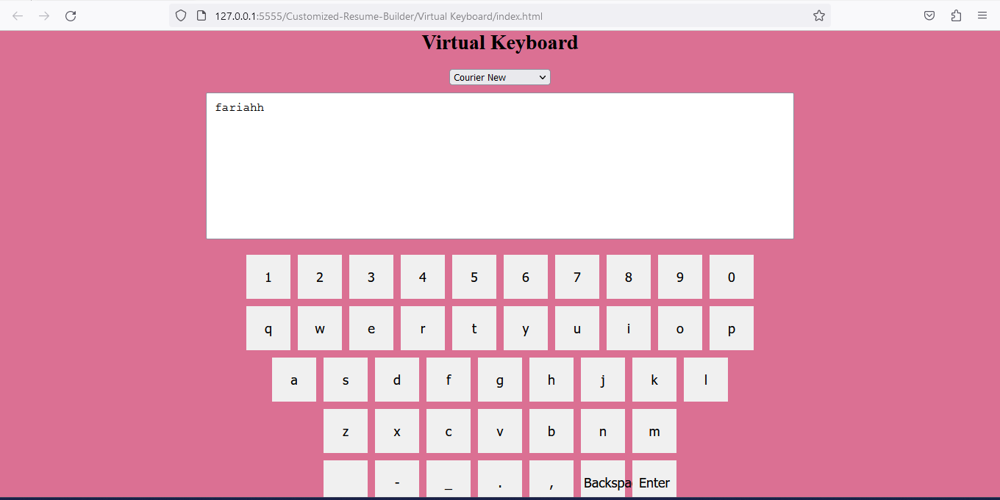

# Virtual Keyboard

A simple virtual keyboard implementation using HTML, CSS, and JavaScript.

## Features

- On-screen virtual keyboard with buttons for each character and special keys.
- Font style selection from a drop-down menu to customize the font of the input field.
- Backspace and Enter keys to delete characters and add new lines, respectively.
- Space, dash, underscore, dot, and comma keys for easy text input.
- Responsive design that works well on different devices.

## Usage

1. Clone or download the repository.
2. Open `index.html` in a web browser.
3. Use the on-screen virtual keyboard to input text in the input field.
4. Select font style from the drop-down menu to customize the font of the input field.
5. Click on the Backspace key to delete characters, and Enter key to add new lines.
6. Click on other keys to input corresponding characters into the input field.
7. Test the virtual keyboard on different devices and screen sizes to see its responsive design.

## Technologies Used

- HTML
- CSS
- JavaScript

